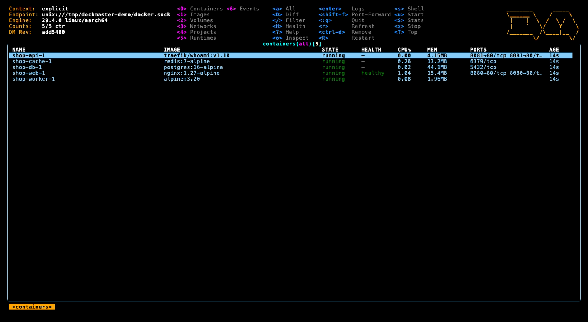
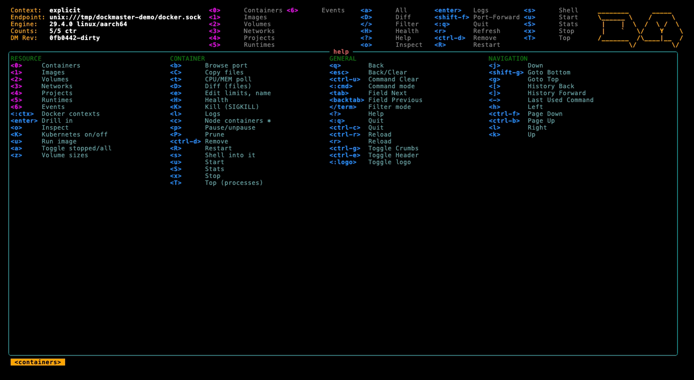
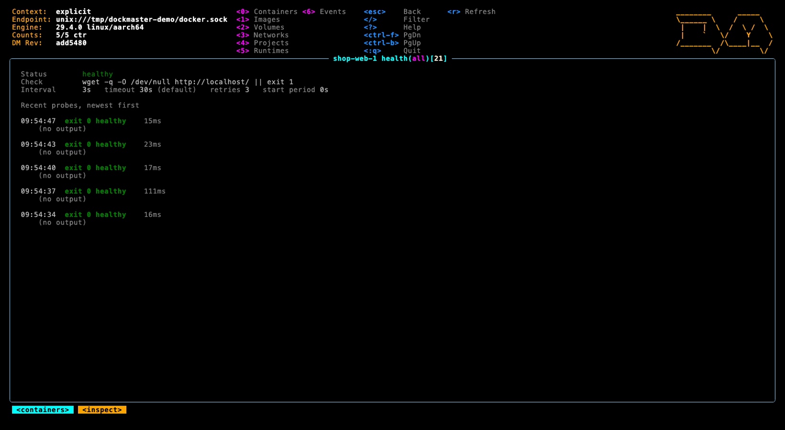
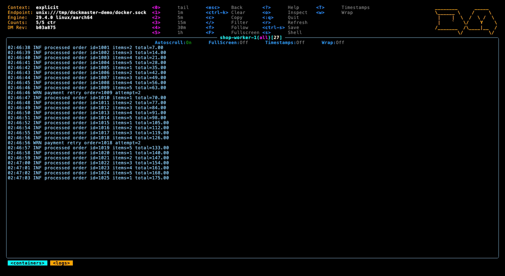
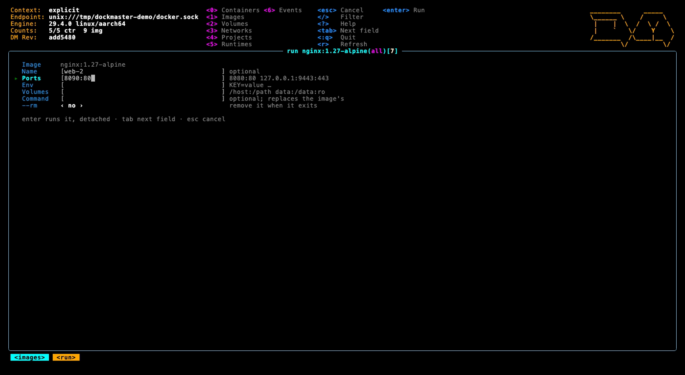
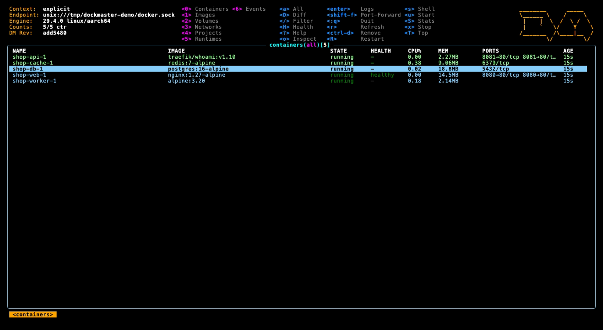
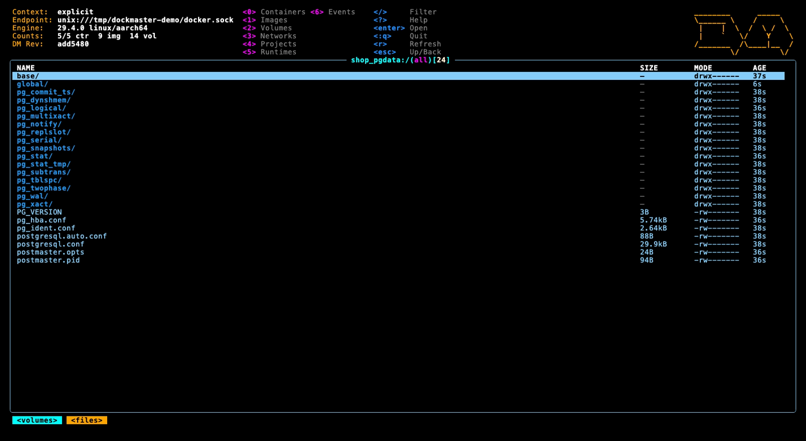

# dockmaster

[](https://github.com/blairham/dockmaster/actions/workflows/ci.yml)
[](https://github.com/blairham/dockmaster/releases/latest)
[](https://github.com/blairham/dockmaster/actions/workflows/codeql.yml)
[](https://scorecard.dev/viewer/?uri=github.com/blairham/dockmaster)
[](go.mod)
[](LICENSE)

A [k9s](https://k9scli.io)-style terminal UI for Docker — containers, images, volumes, networks and Compose projects in one navigable frame, with live log tailing, inspect, and the whole container lifecycle on the keyboard. On a Colima host it manages the VMs under the daemon too.

Built on [tuikit](https://github.com/blairham/tuikit), a shared Bubble Tea chrome.



## Install

```bash
brew install blairham/tap/dockmaster   # installs dockmaster and the dm short name
```

Or download an archive from [Releases](https://github.com/blairham/dockmaster/releases)
— `checksums.txt` is signed with cosign; [SECURITY.md](SECURITY.md#verifying-a-release)
shows how to verify it. From source:

```bash
go install github.com/blairham/dockmaster@latest
# or, from a clone, with the version stamped and the dm alias linked:
make install          # builds, copies to ~/.local/bin, and links dm
```

## Run

`dm` is the short name and runs the same binary.

```bash
dockmaster                        # the active docker context
dockmaster --context colima       # a specific context
dockmaster --readonly             # refuse every mutating action
dockmaster --all                  # start with stopped containers listed
dockmaster --no-stats             # skip the CPU/MEM poll
dockmaster --logoless             # no header logo (`:logo` toggles it at runtime)
dockmaster --invert               # the skin (or the default look) dark to light
DOCKMASTER_SKIN=dracula dockmaster  # a k9s skin from ~/.config/dockmaster/skins/
dockmaster --splashless           # skip the startup splash
dockmaster --headless             # no header at all — the table gets the rows
dockmaster --crumbsless           # no breadcrumbs
dockmaster -r 5                   # refresh every 5s (default 3)
dockmaster --request-timeout 2m   # one limit for every daemon request
dockmaster -c runtimes            # open on a view (containers, images, volumes, networks, projects, runtimes)
```

**Settings persist in `config.yaml`**, shaped like k9s's: `dockmaster config init` writes a commented one with the defaults to `~/.config/dockmaster/config.yaml` (`dockmaster config path` shows where it is read from; `$DOCKMASTER_CONFIG_DIR` and `$XDG_CONFIG_HOME` move it). Every flag above has a key there, plus `context`, `thresholds` (CPU/MEM colours, k9s's 70/90), and `logger.tail` / `logger.showTime`. Flags given on the command line win. See [`docs/design/config.md`](docs/design/config.md).

**It follows your docker context.** The Go SDK only reads `DOCKER_HOST`, which is empty on Colima, Rancher Desktop, Podman and remote hosts — so an SDK tool dials `/var/run/docker.sock` and claims your daemon is down while `docker ps` works fine. dockmaster reads the context store itself, in the CLI's own precedence order. See [`docs/design/docker-context-resolution.md`](docs/design/docker-context-resolution.md).

## Keys

Digits pick the resource; `?` shows everything.

| | | | |
|---|---|---|---|
| `0`–`6` | Containers / Images / Volumes / Networks / Projects / Runtimes / Events | `/` | filter (leading `!` negates) |
| `enter` | drill in — logs, layers, inspect | `:` | command palette |
| `n` | on a ⎈ kind/k3d node: the pods' containers inside it | `d` / `y` | inspect, as `o` (k9s's describe / yaml) |
| `o` | inspect (pretty-printed, colorized JSON); `H` health: the check, its streak, and the last probes' output; `T` top, `D` diff (files changed), `S` full stats; `C` copies files in or out (`docker cp`); `e` edits CPU/memory limits, restart policy and name, live (`docker update`, no restart) | `r` | refresh |
| `u` / `x` | start ("up") / stop; on an image, `u` runs it (name, ports, env, volumes, command, `--rm`) | `R` | restart |
| `K` | kill (SIGKILL — confirms) | `p` | pause / unpause |
| `s` | shell into the container | `ctrl-d` | remove (confirms) |
| `a` | toggle stopped containers / all images | `P` | prune (confirms) |
| `ctrl-k` | show the containers a runtime's built-in Kubernetes runs pods in (hidden by default) | `ctrl-z` | faults only: unhealthy, restarting, dead, or exited non-zero (stopped ones included) |
| `ctrl-w` | wide columns: ID, command, networks and IP | | |
| `t` | toggle the CPU/MEM poll | `z` | volume sizes (slow) |
| on a volume: `enter` | browse its files (`enter` opens, `esc` goes up) | `o` | inspect |
| in a log: `s` | autoscroll on/off (scrolling pauses it, `G` resumes) | `t` | timestamps |
| in a log: `0`–`5` | usual backlog / last 1m, 5m, 15m, 30m, 1h | `w` / `f` | wrap / fullscreen |
| in a log: `c` / `ctrl-s` | copy / save what is shown (`~/.local/state/dockmaster/logs`) | `shift-c` | clear |
| in a log: `m` | mark: a stamped rule at the end, so later lines are easy to find | | |
| in inspect: `c` / `ctrl-s` | copy / save what is shown (saves list in `:sd`) | `f` / `a` | fullscreen / refresh on the poll |

The log keys are k9s's. Where k9s and Docker mean different things the key stays dockmaster's: `p` pauses (k9s's previous-container logs have no Docker equivalent — an exited container's logs are kept), `a` shows stopped containers, and `ctrl-k` shows Kubernetes containers rather than killing one (`K` kills, after a confirm).
| `ctrl-s` | save the table as text (`~/.local/state/dockmaster/dumps`) | `shift-←/→` / `shift-↑/↓` | sort column / direction |
| `c` | copy the row's name to the clipboard | `i` | copy its full ID |
| `U` | on an image, volume or network: the containers using it, stopped ones too (`esc` back) | `J` | on a container: jump to its compose project |
| `space` / `ctrl-space` | mark a row / a range — lifecycle and remove keys then act on every marked row | `ctrl-\` | clear marks |
| `ctrl-g` | toggle breadcrumbs | `ctrl-e` | toggle the header |
| `j` `k` `h` `l` | move (arrows work too) | `g` / `G` | top / bottom |
| `ctrl-f` / `ctrl-b` | page down / up | `ctrl-r` | reload |
| `q` | back out of a drill-in | `[` / `]` / `-` | view history back / forward / last |

Every destructive action asks first, and `--readonly` refuses them outright.

### Commands

`:containers` `:images` `:volumes` `:networks` `:projects` `:colima` · `:pf` (port forwards — `shift-f` on a container starts one, `b` opens a published port in the browser; see [`docs/design/port-forward.md`](docs/design/port-forward.md)) · `:events` (the daemon's live event feed — the last 10 minutes, then as it happens, colored by what each event means; `/` filters, `f` follows) · `:df` (disk usage, like `docker system df`; `P` on a row prunes that kind) · `:logs` / `:inspect` (`:describe`) (the selected row, as `l` / `o`) · `:top` / `:diff` / `:health` (the selected container) · `:ctx` (docker contexts, or `:ctx <name>` to switch directly) · `:sd` (what `ctrl-s` has saved, tables and logs, newest first — `enter` reads one, `ctrl-d` deletes it) · `:pull <ref>` · `:prune` (stopped containers) · `:prune all` (like `docker system prune`: stopped containers, unused networks, dangling images, build cache — volumes kept) · `:prune all volumes` (and every unused volume) · `:prune cache` (build cache) · `:readonly` · `:logo` · `:aliases` (your own `:` names, from `aliases.yaml` — e.g. `pg: containers /postgres`; see [`docs/design/config.md`](docs/design/config.md#aliases)) · a view with a filter, `:containers /postgres` · `:q`. Your own keys for any `:` command go in `hotkeys.yaml`, k9s's format ([`docs/design/config.md`](docs/design/config.md#hotkeys)). Your own commands on the selected row — `dive $IMAGE`, `ctop -f $NAME` — go in `plugins.yaml`, also k9s's format ([plugins](docs/design/config.md#plugins)).

## Screenshots

| | |
|---|---|
|  |  |
| **`?`** — every key the view takes, by section | **`H`** — a container's healthcheck, newest probe first |
|  |  |
| **`enter`** — the log, following, with a mark (`m`) | **`u`** on an image — `docker run` as a form |
|  |  |
| **`space`** — rows marked; `x`, `R` or `ctrl-d` act on all of them | **`enter`** on a volume — its files, read through a read-only helper |

`make screenshots` regenerates all of them — see [Development](#development).

## Notes

- **Compose projects are labels**, folded from `com.docker.compose.project`. In the projects view `l` follows every container's logs in one stream, each line prefixed with its container as `docker compose logs -f` prints it (containers that start later join), `u` is `docker compose up -d`, `e` opens the compose file in `$EDITOR` and runs `up -d` when it comes back changed, `R` restart, `p` pull, `ctrl-d` `compose down` (confirms; volumes kept), run against the compose files the labels record. When those files are not on this machine — a remote daemon, a moved checkout — the keys fall back to acting on the containers directly. See [`docs/design/compose.md`](docs/design/compose.md).
- **Volumes are browsable.** `enter` on a volume lists its files through a short-lived helper container that mounts it read-only with no network — Docker has no API for a volume's files. See [`docs/design/volume-browser.md`](docs/design/volume-browser.md).
- **Skins are k9s's.** Put a k9s skin in `~/.config/dockmaster/skins/` and name it in `config.yaml` (`ui.skin`) or `DOCKMASTER_SKIN`; `--invert` turns any skin, or the default look, dark to light. See [`docs/design/config.md`](docs/design/config.md#skins).
- **The daemon can be slow.** `docker images` on a development host here takes over two minutes. Every list view single-flights its refresh, only the volatile views poll, and the expensive ones load on open and on `r`. See [`docs/design/daemon-latency.md`](docs/design/daemon-latency.md).
- **Container runtimes are view `5`** (`:runtimes`; `:colima` and `:podman` work too). dockmaster finds what is installed — Colima, Podman machines, Docker Desktop, Rancher Desktop, OrbStack — and lists their VMs or engines together. `u` start, `x` stop, `R` restart and `enter` connect work everywhere; `n` new (pick the runtime in the form — that is how the first Podman machine is made), `e` edit resources (and Podman's rootful / user-mode networking), `o` inspect, `ctrl-d` delete and `s` shell where the runtime has machines to manage (Colima, Podman). `K` manages a kind cluster on the machine's Docker daemon: stops or starts the one that is there, or creates one where there is none — a control-plane and a worker, with a local registry on `localhost:5001` wired into the nodes, kind's own recipe (kubectl context `kind-k8s`). The K8S column shows the cluster (bright running, dim stopped), and `own` where a runtime's built-in Kubernetes is on instead. `:pods` lists Podman pods across running machines. If the daemon dockmaster resolves to belongs to a stopped runtime, it opens on this view instead of exiting. See [`docs/design/runtimes.md`](docs/design/runtimes.md).
- **`s` shells out to the `docker` CLI** (via `tea.ExecProcess`), passing `--host` so it always lands on the daemon you are looking at. Interactive TTY handling is a solved problem and not worth re-solving against a hijacked stream.

## Development

```bash
make check              # fmt + vet + test
go test -short ./...    # skip the live-daemon tests
```

`make screenshots` re-renders `docs/images/` with [VHS](https://github.com/charmbracelet/vhs)
(`brew install vhs`). It stages the five-container `shop` project from
`docs/demo/compose.yaml` on `DEMO_HOST` (OrbStack's socket by default — pick a
daemon with nothing of yours on it, since the shots show every container),
plays `docs/demo/screenshots.tape`, and takes the project down again.

Linting is a pre-commit hook (`pre-commit install`), not a make target — a
failing lint fails the commit, which is the only lint output worth reading.

`AGENTS.md` is the working agreement for this repo — read it before changing anything, especially the note on `fieldalignment` reordering struct fields.

## Contributing

Issues and pull requests are welcome — see [CONTRIBUTING.md](CONTRIBUTING.md).
Report security issues privately, as [SECURITY.md](SECURITY.md) describes.

## License

[Apache-2.0](LICENSE). Copyright 2026 Blair Hamilton.
